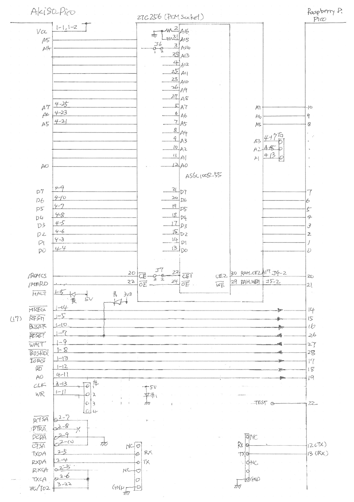
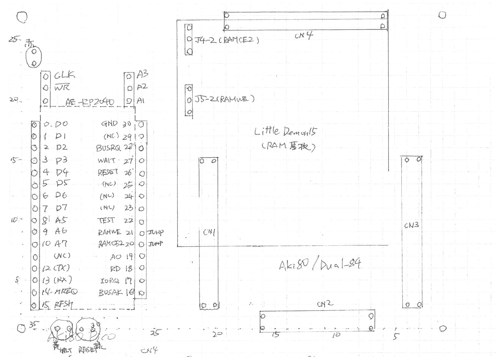
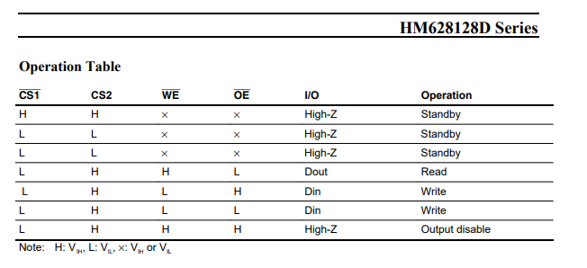

# Aki_Pico 覚書

2025年春に吹き荒れた Super Aki80。私もこの大波に乗るべく、1MB SRAM を搭載し、Raspberry Pi Pico をブートローダとして備えた Aki80 ボードを作成した。

1MB SRAM 搭載(ROMソケットに咬ませる下駄)にあたり、 [@DragonBallEZ](https://x.com/dragonballez) さん作成の ROM/SRAM ドータボード(LittleDemon15)を使わせてもらった。感謝。

## 基本アイディア


* ROMソケットに下駄を咬ませて SRAM を載せる。
* SRAM は ROM 代わりとする。0000-7FFF アクセス時にデータを返す。
* Z80 起動前に SRAM にデータを積む。Pico を用いる。
* Pico は起動後 RESET をアサートし、Z80 を止めておく。
* SRAM にデータ搭載後、RESET をネゲートして Z80 実行を開始する。
* CLockはAki80内蔵ジェネレータ・水晶を使用する。Dual-84 CPU ボードの場合 19.6606MHz 水晶で、Z80 クロックとしては、9.3303MHz となる。

## ハードウェア



* Dual-84/Aki-80 ボードの ROM ソケットに下駄経由で 1MB SRAM を接続する。D0-D7, A0-A14, CE, OE は ROM の端子をそのまま接続する。1MB SRAM の残り 2 本の制御端子 CE2, WE は Pico と直結する。

* Pico はデータバス8本、MREQ, RFSH, RD, RESET, BUSRQ, BUSAK を接続する。ブートロード機能に使用する。
* それに加えて、IORQ, A0, をつなぐ、上記5本と合わせて、UART 用データレジスタ、ステータスレジスタの I/O 空間を得る。
* 今回の Z80互換CPU、TMPZ84C015 は、いくつかの周辺LSI機能を内蔵しており、それらのレジスタが I/O 空間をすでに占めている。それらと衝突しないように、A7,A6,A5 を監視して、001 (アドレス 20-3F)のみを Pico が使用するようにする。
* Pico の UART0 を使用する端子として、GPIO12(TX), 13(RX)を割り当てる。


秋月B基板上に Dual-80/Aki80 基板と Pico、シリアル6ピンを2つ並べる。



+ Pico 用ピンソケットのわきにピンヘッダを立て、ロジアナ観測用の Pico 端子を引き出しておく。
+ Pico 用ピンソケットの空きピンに、ロジアナ観測のためのZ80端子を引き出しておく。
  + CLK, WR, A3, A2, A1


## SRAM の制御

搭載 SRAM として、32ピン 1Mbit SRAM を用いる。アドレス信号は A16 まである。CEは2本、負論理と正論理(CE2)、あと、OE, WE もある。


Dual-84/Aki-80 の ROM ソケットは 256kbit ROM 用で、アドレスは A0-A14 まで。A15, A16 は空くので、固定するためにプルダウンしておく。

CE(負論理)、OEはCPU側に接続されており、Pico から操作できない。CE2, WE を操作することができる、操作するようにする。

Z80 が実行を開始すると、0000-7FFF アクセスは SRAM にアクセスするようになる。A15・MREQ が CS に供給され、MREQ・RD が OE に供給される。SRAM CE2 をアサートしておけば、0000-7FFF 読み出しはそのまま SRAM 読み出しになる。

## bootloading

Z80 実行開始前、Pico は内蔵 Z80 プログラムを SRAM にコピーする。

CE2を使うと M1/Read サイクルを乗っ取ることができる。

Z80 にリセットをかけ、リセット解除すると、Z80 はアドレスバスに 0000 を出力し、最初の命令フェッチを始める。Picoがあらかじめ WAIT をアサートしているので、Z80 はウェイトサイクルに入っている。このとき、Pico は CE2 をネゲートしておき、代わりに Pico の D0-D7 に最初の命令を出力し、WAIT をネゲートする。するとZ80は最初の命令を実行後、次の命令アドレス(おそらく0001)を出力し、命令フェッチを行う。このときも WAIT がアサートされており、Pico が次の命令をおくチャンスがある。

BUSRQを挟むのは、例によって「データバスの Hi-Z 化」を次のマシンサイクル開始までに確実に行うためである。ここをソフトで行うと数100ns かかってしまう。Z80 クロックが高速になると、次のサイクル開始時に、前のサイクルの RD データの出力がバッティングしてしまう。もっと恐ろしいこととして、Pico ソフトが次のマシンサイクル開始を見落として失調してしまうこともある。

マシンサイクルの終了で Z80 をいったん止めて方向制御レジスタのビットをクリアしてから次のマシンサイクルを開始できるように、BUSRQ で次のサイクル開始突入を抑止している。

この「乗っ取り」を使って Pico から SRAM にデータを書き込む。

+ Pico はアドレスバスにアクセスできない。よって、SRAM 書き込み時のアドレス生成は Z80 に行わせる。
  + リセット後 NOP 命令を連続実行させると、NOP 命令実行中のアドレスバスには PC の値が出力されている。つまりアドレスバスには連続するアドレスが現れることになる。
+ NOP 命令実行中に Pico が書き込みたいデータをデータバスに出力し、WE をアサートすると、SRAM にデータが書き込まれるとよいのだが、Z80 が /OE アサート中に Pico が /WE をアサートして書き込みできるか、という懸念がある。

+ M68AF127B(秋月で1個70円で販売している)の場合は、下図の通り「/W は /G に勝つ」つまり /OE アサート中に /WE をアサートすると、SRAM はデータバスへの出力をやめ、書き込みを受け入れる状態に移行する。


+ 私の手元の SRAM (日立 HM68AF127)も同様に「/WE は /OE に勝つ」ので使用可能。 



+ Alliance の AH6C1008 でも「/WE は /OE に勝つ」ようだ。


+ この手を使う場合、Z80 リセット解除後、
  + WAITで M1サイクルを延長させ、
  + RAMWE を Low にして、データバスを出力にして、データを出力する
  + RAMWE を High にして、今度は NOP(00H)を出力する。
  + WAIT をネゲートして、BUSRQ で止めてからデータバスを High-Z にする
  を繰り返すことで SRAM にデータを書き込むことができる。

+ 使用する SRAM が「/WE は /OE に勝つ」でない場合はこの手は使えない。この場合は Z80 にメモリ書き込み命令を実行させて 書く必要がある。よって、以下のような命令列を実行させる必要がある。

```
21 XX XX    LD HL,XXXXH
3E YY       LD A,YYH
67          LD (HL),A
```

CE2 をネゲートした状態でWAITで1サイクルずつ止めながら、21, XX, XX, 3E, YY, 67 を置き、次のマシンサイクルで、CE2 をアサートする(この時、アドレスバスに何も出力せず Hi-Z 状態にしておく)。これを繰り返すことで SRAM に所望のバイトを書き込むことができる。

## プログラム実行中の Pico の処理

UART エミュレーションの I/O ポートレジスタを 20H, 21H に割り当てる。ここへの I/O マシンサイクルは WAIT を掛けて引き延ばし、Pico の UART の状態から Z80 に見せるステータスレジスタのビットパターンを作成する。受信データを読み出して Z80 に返す、または、Z80 から　OUT されたデータを UART 送信する。

割り込み対応の場合は、送信バッファが空になるか、受信バッファに読み出し可能なデータがある場合は INT 端子を Low にして割り込み処理を開始させ、IORQ/M1 が両方ともアサートされているときに割り込み応答ベクタをデータバスに積むが、今回は割り込み対応は行わない。

TMPZ84C015 内蔵の SIO を用いてシリアルコンソールを実現する場合は、Pico の UART は使用しない。

メモリアクセスタイムが不足する場合には、 Tw 挿入機能を WAIT アサートで引き延ばすことで実現できる。メモリアクセス時に 一定時間 WAIT を落とす処理を PIO を用いて実現することができるだろう。

## BASIC インタプリタ

例によって BASIC インタプリタを載せて ASCIIART.BAS を実行して時間を測る。Aki-80 用 BASIC インタプリタは[電脳伝説さんがかつて公開してくださったもの](https://github.com/vintagechips/aki80basic)を使う。解説は[彼のブログ](https://vintagechips.wordpress.com/2018/09/10/aki-80_basic/)にある。


* CN2-7 と 10, CN2-3 と 6, CN3-22 もつないでおく。
* CN2-5 を RXD(pin3)、CN2-4 を TXD(pin4) につなぐ。
* CN2-9 をGND に落としておく。

